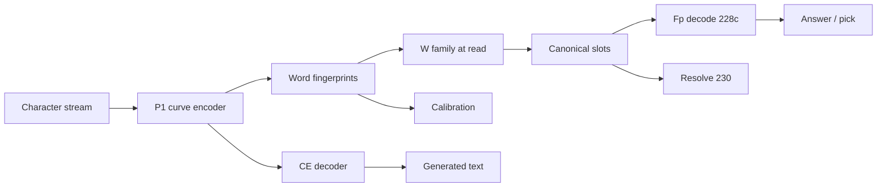

# TapeLM

**TapeLM is a language model where facts and relations live as vectors in the same space as generation.** Unlike RAG, it does not need a second embedder for memory; unlike a parametric GPT, it does not retrain the backbone to edit knowledge — new facts are **slot writes** on a **frozen** curve encoder.

**Root idea — input is characters, not tokens.** The model reads a **character stream** (“ink”) and builds a **curve** in continuous space; **word fingerprints** come from that same path. BPE pieces are targets for the **text head**, not the substrate the memory stack keys on. That is why typos and OOV degrade **smoothly** in fp-space while BPE keys **shatter** (Stage **204**) — and why one encoder can unify generation and memory without a second token embedder.

More context: [`artifact/WHY_TAPELM.md`](artifact/WHY_TAPELM.md) · **Try in ~2 min (no weights):** [`artifact/QUICKSTART.md`](artifact/QUICKSTART.md)

---

## TapeLM vs RAG (at a glance)

| What TapeLM does | Why this is not “RAG + another embedder” |
|------------------|------------------------------------------|
| **Character ink → curve → fp** (not BPE-id memory keys) | RAG/GPT memory keys live in **token** embedding space; one typo can re-split the whole word |
| **One encoder** for generation, memory keys, and calibration | Fair RAG still ties us on **clean** retrieval — but uses **chunk text** and often a **separate** index geometry |
| **Vector slots** (subject keys, values) instead of text chunks | RAG re-prompts the LM and hopes it uses retrieved paragraphs |
| **Lexical calibration** (OOD AUC **0.982** vs BPE surprisal **0.380**) | No native “in *my* lexicon?” signal in vanilla RAG |
| **One-shot edit** (**1.00** vs GPT **~0.28** on our exam) without finetune | Parametric edit needs gradients; RAG needs re-index + prompt craft |
| **Cross-domain read** via **W_family** + canonical bank (**227**) | Full re-index when the embedder “dialect” shifts |
| **Fp decode + resolve** (**228c**, **230**) when the CE head ignores memory | RAG has no fp-scorer or slot-level conflict policy |

Honest scope: on **clean static recall**, a **fair GPT+RAG** baseline can **match** our scores — we document that. Headline wins: **structure**, **noise/unlearn (204–205)**, and the **product memory track** below.

---

## How it works

*Substrate: **characters**, not BPE token IDs. Memory keys fingerprints from the curve; the CE head emits BPE pieces.*



```text
Characters (stream) → arc_enc → fp(word)     ← memory, calibration, hops key here
                         └─ CE head → BPE text   ← generation readout only
```

Full diagram + frozen-P1 table: [`docs/ARCHITECTURE.md`](docs/ARCHITECTURE.md)

---

## Stage map (~30 seconds)

Curated headline results (full index: [`docs/STAGES.md`](docs/STAGES.md) · JSON: [`artifact/decisions/`](artifact/decisions/) · `python artifact/scripts/show_map.py`).

| Stage | What was tested | Headline result |
|-------|-----------------|-----------------|
| **191** | Generation vs matched GPT | Parity **0.867 vs 0.843** |
| **192–193** | Lexical OOD calibration | AUC **0.982** (GPT **0.380**) |
| **194–195** | Fact memory; hop2 / binding | **0.947** / **0.70** |
| **197** | One-shot knowledge edit | **1.00** (GPT **~0.28**) |
| **204–205** | Noise vs fair RAG; slot unlearn | **0.913 vs 0.627**; delete w/o collateral |
| **221→227→228c→230→226c** | Product memory track (domains, conflicts, **use** of memory) | fp decode **~1.0** vs head **~0.48**; cross-domain **~0.88** |

---

## Known limits

Documented in repo — not hidden in footnotes:

| Area | Verdict |
|------|---------|
| **Semantic invariance (PAWS / “B”)** | Not confirmed at RTX 3050 scale (**209**); curve ≈ matched GPT |
| **Generate next fingerprint (variant B)** | **Falsified** (**207**) |
| **Fp rerank on BPE head** | **No gain** on clean text (**208**) |
| **Hops inside transformer forward** | **THESIS_NO** (**210–212**); external fp loop remains the hop API |
| **Clean static recall vs fair GPT+RAG** | **Parity** — not a capability trump card (**196**, **198**) |

Details: [`results/extension_closed_branches.md`](results/extension_closed_branches.md) · preprint §5.4–5.5

---

## Product memory track (for implementers)

After core fp (**191–205**) and closed internalization (**210–212**), the **shipping** path we demo is:

**221 → 227 → 228c → 230 → 226c**

| Step | Stage | Plain language |
|------|-------|----------------|
| **221** | W-remap | If encoder geometry shifts, migrate with a tiny **W**, don’t rebuild every slot |
| **227** | Canonical + qmap | One slot bank; read through **W_bwd** per domain |
| **228c** | Fp decode | **Use** retrieved values (scorer ~**1.0**); CE head alone ~**0.48** |
| **230** | Resolution | Pick among conflicting slot hits (~**1.0** vs raw argmax ~**0.47**) |
| **226c** | Cross-domain e2e | End-to-end **~0.88** fp vs **~0.45** head |

```bash
python artifact/scripts/run_product.py   # needs P1 weights — see QUICKSTART
```

Contract: [`results/extension_memory_contract.md`](results/extension_memory_contract.md) · API: [`docs/MEMORY_ENGINEERING.md`](docs/MEMORY_ENGINEERING.md)

---

## Quick start

| Time | Needs weights? | Command |
|------|----------------|---------|
| **~2 min** | No | `pip install -r artifact/requirements.txt` then `python artifact/scripts/show_map.py` |
| **~5–15 min** | Yes (HF download) | [`artifact/QUICKSTART.md`](artifact/QUICKSTART.md) → `download_checkpoints.py --with-w-registry` → `run_product.py` |

Python 3.10+, PyTorch, `tokenizers`, `transformers`. GPU recommended for the full demo.

---

## Read next

| | |
|--|--|
| Product one-pager | [`artifact/OVERVIEW.md`](artifact/OVERVIEW.md) |
| Preprint | [`results/preprint_tapelm_draft.md`](results/preprint_tapelm_draft.md) |
| Full program | [`results/plan_curve_dynamics.md`](results/plan_curve_dynamics.md) |
| Publish / HF | [`docs/PUBLISHING.md`](docs/PUBLISHING.md) |

---

## Citation & license

[`CITATION.cff`](CITATION.cff) · MIT [`LICENSE`](LICENSE)
