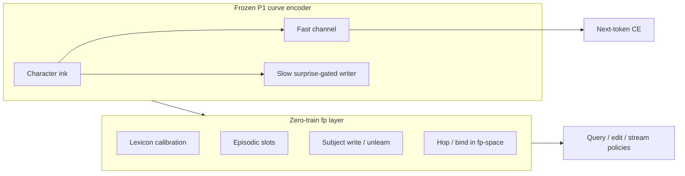

# TapeLM — one page

## The idea in one sentence

Treat language as **curves over characters**, and treat **memory as fingerprints in the same space as those curves** — so generation, novelty, recall, and edit share one geometry instead of splitting “model weights” vs “retrieved text.”

---

## Non-standard by design

Most LMs **parametrize** facts in weights. RAG **externalizes** facts as documents and re-reads strings at query time. TapeLM (variant A) externalizes facts as **vectors**:

- `fp(word) = normalize(arc_enc(word))` on a **frozen** dual-channel encoder (P1).
- **Lexicon** = entity fingerprints → lexical surprise / calibration (192–193).
- **Episodic slots** = context fp keys → entity values (194).
- **Hop2 / binding** = cosine chains or `norm(fp_A ⊙ fp_B)` (195, 203).
- **Edit / unlearn** = overwrite or delete slots, not gradient surgery on the backbone (197, 205).

Composition is an **external zero-train fp loop** on P1. That is the architectural bet: operable memory APIs without a second embedding model or fine-tuned reranker.

We compare honestly to **matched GPT** and **fair GPT+RAG** (same surprise gating and retrieval math where applicable). The headline is **a working fp-stack on a non-standard substrate**, with **staged wins and clear boundaries** — not “SOTA on every axis.”

---

## What the staged program shows

**Confirmed wins (documented):** P1 generation parity (~0.87 vs ~0.84 matched GPT); fp lexicon **calibration**; **fact recall** and hop2/**binding**; one-shot **edit**; **stream** under memory budget (191–198); structured **external hops** (203); **noise/OOV** vs fair RAG (204); **slot unlearn** without collateral (205).

**Closed branches** (where we stopped claiming — not the main story):

| Line | Verdict | Stages |
|------|---------|--------|
| Generate **next fingerprint** (“curve as thinking”) | Falsified | 207, 207-MAX |
| Hybrid fp rerank on BPE head | No gain | 208 |
| Semantic invariance @ PAWS on 3050 | Not confirmed; same scale wall as small GPT | 209 |
| Hops **inside** forward → answers as **tokens** | THESIS_NO | 210 |
| Addressable **slow tape** cross-document | THESIS_NO | 211 |
| **Instance** channel on frozen state | THESIS_NO | 212 |

---

## Who might care

- **Architecture researchers** — character-curve substrate + dual-channel writer; full staged program with wins and labeled dead ends.
- **Memory / RAG people** — vector-native slots and binding vs chunk retrieval; explicit parity protocol.
- **Robustness / editing** — character fp under noise; O(1) slot unlearn vs parametric collateral.
- **Method-minded readers** — per-stage JSON verdicts (wins such as 192–205 and closed lines such as 207–212).

---

## Read next

| Depth | File |
|-------|------|
| 5 min table of verdicts | `python artifact/scripts/show_map.py` |
| Implementer view | [`../docs/ARCHITECTURE.md`](../docs/ARCHITECTURE.md) |
| Full narrative | [`../results/plan_curve_dynamics.md`](../results/plan_curve_dynamics.md) |
| Preprint-shaped prose | [`../results/preprint_tapelm_draft.md`](../results/preprint_tapelm_draft.md) |

**Open engineering note (209):** strong semantic invariance likely needs **larger encoder pretrain** and a **meaning objective** — not adapters alone on frozen P1.
