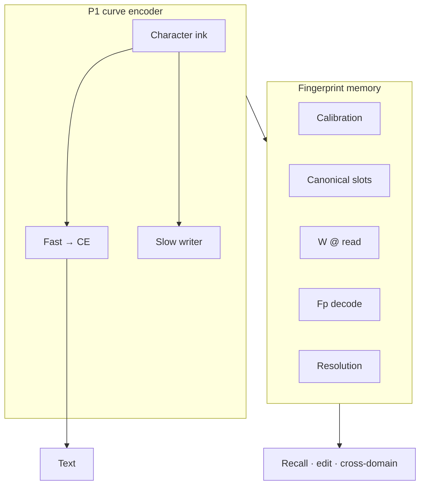

# TapeLM — one page

## The idea in one sentence

**One frozen curve encoder; one fingerprint geometry** for text generation, fact memory, calibration, editing, cross-domain recall, and principled conflict resolution — without a separate retrieval embedding pipeline.

---

## A non-standard stack that ships as one product

TapeLM variant A combines:

1. **Substrate** — dual-channel character-curve encoder (P1).
2. **Fp operations** — shared `fp(word) = normalize(arc_enc(chars))` for calibration, slots, hops, edit, stream.
3. **Memory system** — canonical slot bank, **W_prose / W_code**, **228c** decode, **230** resolution when writes disagree.

The design bet is **operable memory in the same space as generation**: vector slots and policies you can write, read, migrate, decode, and resolve — on one encoder.

**Staged evidence** backs each layer (191–205, 221–230, 226c). We report **matched GPT** and **fair GPT+RAG** baselines on the axes each stage defines.

---

## Architecture

**Highlights:** generation parity (191); calibration & recall (192–194); hops & edit (195, 197, 203); noise/unlearn vs fair RAG (204–205); **canonical + W** (227); **fp decode utilization** (228c, 226c); **contradiction policy** (230).

---

## Research scope (for a complete picture)

Some directions were **explored and not carried into the v1 product claim** — variant B fingerprint prediction (207), BPE fp rerank (208), small-scale PAWS semantic B (209), tokenized internal hops / slow tape / instance channel (210–212). Stage JSON records the outcomes; the **shipping story** is the integrated curve + fp + canonical memory path above.

---

## Read next

| Depth | File |
|-------|------|
| **Quickstart** | [`QUICKSTART.md`](QUICKSTART.md) |
| Verdict table | `python artifact/scripts/show_map.py` |
| Architecture (diagram) | [`../docs/ARCHITECTURE.md`](../docs/ARCHITECTURE.md) |
| Memory API | [`../docs/MEMORY_ENGINEERING.md`](../docs/MEMORY_ENGINEERING.md) |
| Memory narrative | [`../results/extension_memory_contract.md`](../results/extension_memory_contract.md) |
| Long program | [`../results/plan_curve_dynamics.md`](../results/plan_curve_dynamics.md) |
| Preprint draft | [`../results/preprint_tapelm_draft.md`](../results/preprint_tapelm_draft.md) (2026-07-30; §4.8 memory trunk) |
