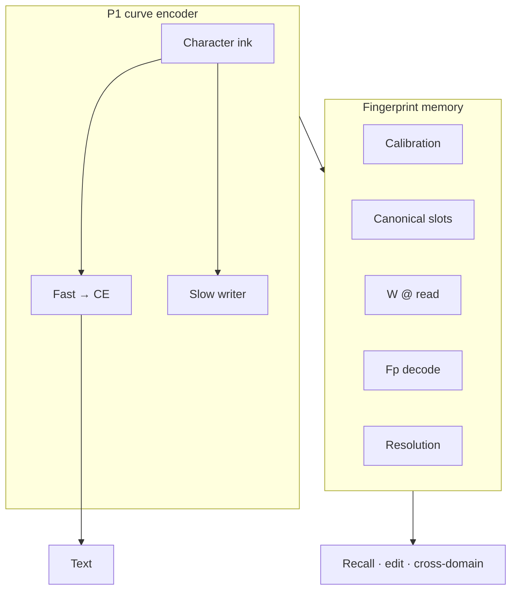

# TapeLM — one page

> **Shipping trunk:** **221 → 227 → 228c → 230 → 226c** · [`QUICKSTART.md`](QUICKSTART.md)

**Longer story for humans:** [`WHY_TAPELM.md`](WHY_TAPELM.md)

---

## The pitch

**Facts as fingerprints on character ink** — not a token-id store, not retrieved paragraphs.

One **character-curve encoder** (P1): **fp** slots and policies on the same map as text (**ink→arcBPE**, not GPT token-BPE). Fair GPT+RAG can **tie** clean retrieval in our exams; the documented separations are **substrate + structure** (§5.1 preprint), **noise/unlearn (204–205)**, and the **product trunk** (**228c** / **226c** utilization).

---

## Five ideas worth your time

1. **Unified fp-space** — one frozen P1; no second representation learning step for memory at inference.
2. **Structured ops** — bind, hop, subject-write, **230** resolve; not paragraph re-prompting.
3. **Frozen skills, mutable facts** — P1 fixed; slots + **W** carry continual knowledge (205 unlearn; §3.1 preprint).
4. **Measured breaks vs fair RAG** — noise **0.913 vs 0.627** (204); parametric unlearn vs slot delete (205).
5. **Trunk 221→227→228c→230→226c** — canonical bank, domain **W**, **fp decode** (~1.0 vs head ~0.48), policy (~1.0 vs argmax ~0.47), cross-domain e2e (~0.88 vs ~0.45).

---

## vs RAG (honest)

| | Fair GPT+RAG | TapeLM |
|---|--------------|--------|
| Clean static recall | Often **ties or ahead** | Parity — not the sell |
| What memory *is* | Text chunks | **Fp keys/values + policies** |
| Relations | Prompt / tools | **Bind + hop** in fp (195, 203) |
| Use retrieved knowledge | Hope the LM reads the prompt | **228c** scorer; **226c** e2e |
| Conflicts | Merge in context | **230** over slot candidates |

Details: preprint **§5.1** · [`../results/preprint_tapelm_draft.md`](../results/preprint_tapelm_draft.md)

---

## Architecture

**Frozen encoder:** fact ingest does not train P1 — [`../docs/ARCHITECTURE.md`](../docs/ARCHITECTURE.md#frozen-p1--precise-contract)

---

## What we closed (credibility)

Internal hops in the forward pass (210–212), fingerprint-as-output (207), fp rerank on the token head (208) — all **negative**, all logged. The shipping story is **external structured fp memory + trunk above**.

---

## Read next

| Depth | File |
|-------|------|
| **Why TapeLM** | [`WHY_TAPELM.md`](WHY_TAPELM.md) |
| **Quickstart** | [`QUICKSTART.md`](QUICKSTART.md) |
| Diagram + frozen table | [`../docs/ARCHITECTURE.md`](../docs/ARCHITECTURE.md) |
| Memory API | [`../docs/MEMORY_ENGINEERING.md`](../docs/MEMORY_ENGINEERING.md) |
| Preprint | [`../results/preprint_tapelm_draft.md`](../results/preprint_tapelm_draft.md) |
| Full program | [`../results/plan_curve_dynamics.md`](../results/plan_curve_dynamics.md) |
