# TapeLM — one page

## The idea in one sentence

**Not RAG with another embedder:** one frozen curve encoder; **knowledge structure** (slots, bind, hops, edit, resolve) as **operable vectors** in the same fingerprint geometry as text generation—not retrieved chunks re-fed to the model.

---

## A non-standard stack that ships as one product

TapeLM variant A combines **two shipped evidence lines** on one encoder:

1. **Core fp (191–205)** — calibration, slots, hops, edit, stream; wins on noise/unlearn (204–205).
2. **Memory trunk (221–230, 226c)** — canonical bank, **W**, **228c** decode, **230** resolve; **strongest product demos** (`run_product.py`). Extension program **213–220** (incl. **215 NO**) led here; see [`docs/STAGES.md`](../docs/STAGES.md).

Components:

1. **Substrate** — dual-channel character-curve encoder (P1).
2. **Fp operations** — shared `fp(word) = normalize(arc_enc(chars))` for calibration, slots, hops, edit, stream.
3. **Memory trunk** — canonical bank, **W**, **228c**, **230** (Stages **221–230**).

The design bet is **operable memory in the same space as generation**: vector slots and policies you can write, read, migrate, decode, and resolve—**structured knowledge**, not opaque text retrieval. On **clean** recall, fair GPT+RAG can **tie** us on score; the headline is **architecture** (one geometry + vector-native APIs), plus measured wins on noise/unlearning (204–205) and cross-domain **W + fp decode** (226c).

**Staged evidence** backs each layer (191–205, 221–230, 226c). **Matched GPT** and **fair GPT+RAG** baselines are on every axis the stage defines.

---

## vs RAG (honest)

| | Fair GPT+RAG | TapeLM |
|---|--------------|--------|
| Clean static recall | Often **ties or ahead** on score | Parity — not the trump card |
| Representation | Chunk **text** + (often) second embedder | **One** `arc_enc`; fp keys/values |
| Relations / hops | Re-prompt or tool chains | **Bind + hop** in fp-space (195, 203) |
| Edit / unlearn / conflict | Index delete; prompt merge | Subject write, **230** policy, slot delete (197, 205, 230) |

Argument in full: preprint **§5.1** · [`../results/preprint_tapelm_draft.md`](../results/preprint_tapelm_draft.md)

---

## Architecture

```mermaid
flowchart TB
  subgraph enc["P1 curve encoder"]
    INK["Character ink"]
    FAST["Fast → CE"]
    SLOW["Slow writer"]
    INK --> FAST
    INK --> SLOW
  end
  subgraph mem["Fingerprint memory"]
    LEX["Calibration"]
    SLOT["Canonical slots"]
    W["W @ read"]
    DEC["Fp decode"]
    RES["Resolution"]
  end
  enc --> mem
  FAST --> TEXT["Text"]
  mem --> OUT["Recall · edit · cross-domain"]
```

**Highlights:** **Pillar A** — parity (191); calibration & recall (192–194); hops & edit (195, 197, 203); noise/unlearn vs fair RAG (204–205). **Pillar B (221–230)** — canonical + W (227); **fp decode ~1.0 / cross-domain ~0.88** (228c, 226c); **resolution ~1.0** (230).

**Frozen encoder:** P1 weights are fixed for fact write/read; continual knowledge goes into **slots** and **W**, not into finetuning `arc_enc` on the product path. Full table: [`../docs/ARCHITECTURE.md`](../docs/ARCHITECTURE.md#frozen-p1--precise-contract).

---

## Research scope (for a complete picture)

Some directions were **explored and not carried into the v1 product claim** — variant B fingerprint prediction (207), BPE fp rerank (208), small-scale PAWS semantic B (209), tokenized internal hops / slow tape / instance channel (210–212). Stage JSON records the outcomes; the **shipping story** is the integrated curve + fp + canonical memory path above.

---

## Read next

| Depth | File |
|-------|------|
| **Quickstart** | [`QUICKSTART.md`](QUICKSTART.md) |
| Verdict table | `python artifact/scripts/show_map.py` |
| Architecture (diagram) | [`../docs/ARCHITECTURE.md`](../docs/ARCHITECTURE.md) |
| Memory API | [`../docs/MEMORY_ENGINEERING.md`](../docs/MEMORY_ENGINEERING.md) |
| Memory narrative | [`../results/extension_memory_contract.md`](../results/extension_memory_contract.md) |
| Long program | [`../results/plan_curve_dynamics.md`](../results/plan_curve_dynamics.md) |
| Preprint draft | [`../results/preprint_tapelm_draft.md`](../results/preprint_tapelm_draft.md) (§3.1 frozen P1; §4.8 memory trunk) |
