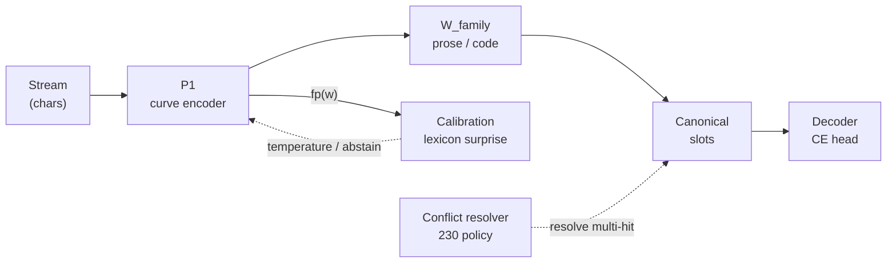

# TapeLM architecture (variant A)

> **Shipping trunk:** **221 → 227 → 228c → 230 → 226c** (W → canonical + qmap → decode → resolve → cross-domain e2e). Demo: [`../artifact/scripts/run_product.py`](../artifact/scripts/run_product.py).

**One product:** **character ink → curve (P1) → fp** for memory; **arcBPE** readout for text — plus core fp **191–205** and memory trunk **221–230** on the same `arc_enc`. Implementers: [`MEMORY_ENGINEERING.md`](MEMORY_ENGINEERING.md) (trunk API). Numbers: [`results/preprint_tapelm_draft.md`](../results/preprint_tapelm_draft.md) §4.8, [`results/plan_curve_dynamics.md`](../results/plan_curve_dynamics.md). Post-trunk ops **231–235** (temporal W, stream version, tool bind, compositional W, mixed L1 probe) are documented there as **engineering**, not the shipping trunk.

### arcBPE — not GPT BPE

People say “BPE” when they mean **text**, not byte-merge tables. TapeLM keeps that intuition but splits it from GPT’s stack:

| | **GPT BPE** (token BPE) | **arcBPE** (TapeLM) |
|---|-------------------------|---------------------|
| **Encoder input** | BPE token ids | **Character ink** |
| **Memory / retrieval keys** | Token embeddings | **fp** from the same ink path |
| **Text output** | Next token id | Next **arcBPE** piece from **arc state** |

**arcBPE** — BPE-style next-piece CE on the curve (train + infer). Vocabulary merges are the usual byte-level machinery (Stage 177 **Curve-BPE** in scripts); what changes is **where** BPE lives: readout from arcs after ink, not an id stream through the whole model.

**ink→arcBPE** — shorthand for the product path: **ink in**, **arcBPE out**. Same idea as **inkBPE** in conversation (“BPE on the ink stack, not GPT BPE”).

**Do not conflate:** fair baselines and §204 comparisons still say **GPT BPE** when the rival is token-in / token-keyed RAG.

---

## System diagram (inference)

Main path: **character stream → frozen curve encoder → optional family W at read → canonical slots → token decoder.** Calibration and conflict resolution attach to **fp geometry** and **slot retrieve**, not to a second embedder.

```text
  Stream (chars)
        │
        ▼
  ┌─────────────────┐
  │  P1 curve enc   │  fast + slow tape; CE targets = arcBPE pieces
  │  (dual-channel) │
  └────────┬────────┘
           │  fp(w) = norm( arc_enc( chars of w ) )
           │
           ▼
  ┌─────────────────┐
  │  W_family       │  prose │ code │ …     read-time qmap only
  │  (lens @ read)  │  qq = norm( W_bwd @ q_domain )
  └────────┬────────┘
           │
           ▼
  ┌─────────────────┐
  │  Canonical      │  keys stored in P1 fp (227 write)
  │  slot bank      │  4-way retrieve → fp decode (228c) when constrained
  └────────┬────────┘
           │
           ▼
  ┌─────────────────┐
  │  Decoder        │  CE head (+ optional head_family, 225)
  └─────────────────┘


Stream ──► P1 ──► W (prose/code) ──► Slots ──► Decoder
            ▲              ▲              ▲
            │              │              │
   Calibration      same fp space   Conflict resolver
   (lexicon)        (W migrates      (230: pick among
   192–193          coordinates)    multi-hit, 229)
```



| Step | What happens |
|------|----------------|
| **Write** | Context/query fps from P1 **canonical** geometry; slot **keys** stay in that space (no W on write). |
| **Read (other domain)** | Query fp → **W_bwd** → match keys → **228c** scores candidates with `cos(fp(c), fp(retrieved))` when the head alone underuses memory. |
| **Calibrate** | Lexicon surprise on **fp** modulates generation confidence (193); read-only w.r.t. slot geometry. |
| **Resolve** | After retrieve, **230** chooses among conflicting values (provenance / recency / query cue); not fixable by cosine alone (229). |

External **multi-hop** (203) loops in fp-space beside this path — not inside the transformer forward (210 **THESIS_NO**). Details: [`MEMORY_ENGINEERING.md`](MEMORY_ENGINEERING.md).

---

## Frozen P1 — precise contract

**Strong claim (variant A product):** the **canonical** curve encoder weights in `stage191_p1_curve.pt` are **not updated** when you add facts, run recall, calibrate, hop, edit, or resolve conflicts. Memory modules are **zero-train** on that encoder (192–205). At inference the stack runs in **`eval()`**; gradients do not flow into `arc_enc` on the product path.

| Component | Trained when? | Updated during normal use? |
|-----------|---------------|----------------------------|
| **P1 `arc_enc` + slow/fast (191)** | Once, offline (~150M chars pretrain) | **No** — load checkpoint, freeze |
| **CE / optional `head_family` (225)** | Pretrained with P1 (191; heads in 225 exams) | **No** on memory demo / slot ingest |
| **Lexicon calibration (193)** | Two scalars fit on frozen fp | **No** at fact write time |
| **Episodic slots, hop, edit (194–198)** | **Zero-train** — cosine / binding on fp | **No** — write/delete slots only |
| **`W_family` (221–225)** | Small d×d matrix on ~800 **core words** after a measured shift | **No** online — load `w_registry/` or export offline |
| **228c / 230 policies** | Fixed algorithms + optional exam metadata | **No** |

**What “frozen” does *not* mean**

- **History:** P1 was **trained** in Stage 191; “frozen” means **fixed after that** for the product contract (213: fp drift ~10⁻⁷ when upper layers alone are tuned — **default is full `arc_enc` freeze**).
- **Research stages** (221, 226c, …) **intentionally finetune `arc_enc`** on toy corpora to **simulate domain drift** and fit **W** — that is an exam, not the shipped ingest loop. The product answer is: **keep canonical slot keys**, apply **W @ read** (227 qmap), not rebuild the bank.
- **Cross-domain demo (step 3):** if `w_registry/` is missing, the script may **briefly finetune a copy** of the encoder to synthesize a code-domain query side — still **canonical slots unchanged**; prefer `download_checkpoints.py --with-w-registry` so only **loaded W** runs, not ad-hoc finetune. (When registry exists, step 3 may still finetune a **query-side** copy to mimic code ink; canonical **write** fp always comes from frozen P1 loaded in step 1.)

**One-line summary:** **skills and geometry reference live in frozen P1; facts live in slots; domain drift is handled by W, not by retraining the canonical encoder during memory operations.**

---

## Confirmed on variant A (single stack)

**Generation & core fp (191–205):** parity; calibration, recall, hop2/bind, edit, stream; external hops (203); noise/unlearn vs fair baselines (204–205).

**Memory system (221–230, 226c):** W-remap; **canonical** slot bank + **qmap** read (227); **228c** fp decode; cross-domain **226c**; contradiction **230** resolution over multi-hit slots (229).

---

## Layer 0 — Curve substrate (frozen after Stage 191)

| Piece | Role |
|-------|------|
| **Ink** | Characters (not arcBPE ids as encoder input) drive the forward pass. |
| **Fast channel** | Transformer over arc embeddings → next-piece CE on arcBPE targets. |
| **Slow channel** | Surprise-gated writer; retention without auxiliary losses that poisoned CE (ablated 185). |
| **Self-model surprise** | Read-only signal for calibration wiring (188–189); gradient-detached from CE (“anti-Goodhart”). |

Checkpoint: `checkpoints/stage191_p1_curve.pt` (SelfModelXL d256, 6L, ~150M chars on RTX 3050 class hardware).

**Why it matters:** typos and OOV degrade **character fingerprints** smoothly; **GPT BPE** keys re-fragment under noise — Stage 204.

**arcBPE role:** the stack **trains on and emits arcBPE pieces** via the CE head. **Memory and facts** do **not** use piece ids as their primary geometry — they use **fp** from character ink on the same `arc_enc`.

---

## Layer 1 — Word fingerprints (zero-train on P1)

```text
fp(w) = normalize( arc_enc( characters of w ) )
```

All modules below share this definition and the **same** frozen encoder.

| Module | Mechanism | Train? |
|--------|-----------|--------|
| **Generate** | CE head on `[fast; slow]` | Pretrained (191) |
| **Calibrate** | Lexicon surprise → head temperature (193) | 2 scalars |
| **Recall** | Episodic slots: key = context fp, value = entity (194) | Zero |
| **Hop2 / bind** | Cosine chain or `norm(fp_A ⊙ fp_B)` (195, 203) | Zero |
| **Edit** | Subject-anchored write `key = norm(fp(S)+ctx)` (197) | Zero |
| **Write policy** | Admit slots under fp-lexicon surprise + budget (197–198) | Zero |
| **Unlearn** | Delete slot; measure collateral (205) | Zero |

**Composition contract:** multi-hop and streaming are **external fp loops** — not latent hops emitted as tokens inside the transformer (210 **THESIS_NO**).

---

## Layer 2 — Canonical memory & policies (same product)

When the runtime encoder **domain** differs from write-time canonical P1, slot keys **stay** in canonical fp; queries use **`W_family_bwd`** (qmap). Utilization at constrained decode uses **228c**; conflicting writes use **230** (not the slot geometry itself).

| Piece | Contract |
|-------|----------|
| **W registry** | `prose` / `code` (+ fork-on-drop); `checkpoints/w_registry/` |
| **Read** | `qq = norm(W_bwd @ q_domain)`; 4-way retrieve on candidate sets (227) |
| **Decode (228c)** | `cos(fp(c), fp(retrieved))` — official path (226c e2e) |
| **Resolve (230)** | `resolve_slot_contradiction` on annotated multi-hit slots |
| **Anti-pattern** | Global slot argmax + fp (228b); raw `cos(fp(c), query)` (228c `fp_query`) |

API: [`MEMORY_ENGINEERING.md`](MEMORY_ENGINEERING.md), `_tapelm_ext.py`.

---

## Layer 3 — Baselines (fair comparison)

- **Matched GPT-2** — same scale and exam protocol (191-P2).
- **Fair GPT+RAG** — same retrieval math and surprise-gated admission as the fp stack where stages require it (196, 204).

Claims are split:

- **vs vanilla GPT** — non-generation axes (calibration, edit, stream).
- **vs fair RAG** — mostly **architectural unification**; **capability** wins where documented (204 noise, 205 unlearn).

---

## Research scope (explored; not part of the v1 product claim)

| Attempt | Result |
|---------|--------|
| **Variant B** — predict next fingerprint instead of token | **Falsified** (207): fingerprint is spelling code; spelling is not predictable from context. |
| **Hybrid fp reranker** on BPE head | **No gain** (208). |
| **Semantic B** @ PAWS on 3050 | **Not confirmed**; not structurally blocked vs GPT (209). |
| **SoftFollow in forward** → answer tokens | **THESIS_NO** (210). |
| **Internal slow tape** cross-doc | **THESIS_NO** (211). |
| **Instance channel** on frozen state | **THESIS_NO** (212). |

---

## Runnable entrypoints

| Goal | Script |
|------|--------|
| Full assemble scorecard | `_stage196_tapelm.py` or `artifact/scripts/run_demo.py` |
| Memory e2e (code + canonical) | `_stage226c_joint_fp_decode.py` |
| Resolution policy | `_stage230_slot_resolution.py` |
| Export family W | `artifact/scripts/export_w_registry.py` |
| Noise vs fair RAG | `_stage204_noise_robustness.py` |
| Structured internal hops | `_stage203_internal_hops.py` |
| Variant B smoke | `_stage207_curve_thinking.py`, `_stage207_max.py` |

Stage index: [`STAGES.md`](STAGES.md).
