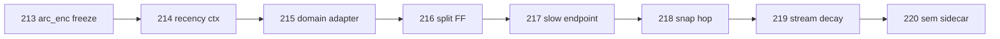

# TapeLM extension pipeline (Stages 213+)

Research stages for **TapeLM variant A** — the same product as 192–205, extending freeze policy, memory migration, decode, and resolution. Same frozen-P1 contract unless a stage says otherwise.  
Run from repo root:

```bash
python artifact/scripts/run_pipeline.py --list
python artifact/scripts/run_pipeline.py --from 214 --to 220
python artifact/scripts/run_pipeline.py --from 214 --to 220 --smoke
python artifact/scripts/run_pipeline.py --force   # re-run even if decision.json exists
```

**Prerequisite:** `checkpoints/stage191_p1_curve.pt` (HF: [Kostya03v/TapeLM-P1](https://huggingface.co/Kostya03v/TapeLM-P1)).

---

## Order and dependencies



| Stage | Script | Idea | Train? | Status |
|-------|--------|------|--------|--------|
| **213** | `_stage213_arc_enc_freeze_finetune.py` | Full `arc_enc` freeze; upper finetune | upper only | **Done** |
| **214** | `_stage214_recency_ctx.py` | Recency-weighted `ctx_fp` | Zero | Done (`RECENCY_CTX_NO`) |
| **215** | `_stage215_domain_adapter.py` | `domain_proj` on frozen fp | Tiny MLP | Implemented |
| **216** | `_stage216_split_arc_ff.py` | Frozen emb+pool; linear vs GELU FF | FF only | Implemented |
| **217** | `_stage217_slow_endpoint_slots.py` | External slow-endpoint keys + 204 | Zero | Implemented |
| **218** | `_stage218_snap_hop.py` | Explicit lexicon snap in hops | Zero | Implemented |
| **219** | `_stage219_stream_decay.py` | Slot decay / subject refresh | Zero policy | Implemented |
| **220** | `_stage220_sem_sidecar.py` | PAWS contrastive sidecar | sem_head | Done |
| **221** | `_stage221_fp_remap_adapter.py` | **W-remap** after arc_enc shift | Tiny W | Implemented |

Closed branches: [`../results/extension_closed_branches.md`](../results/extension_closed_branches.md).

---

## Gates (summary)

### 213 — freeze full `arc_enc`
- **G1:** fp drift &lt; 1e-5 after upper finetune  
- **G2:** arc_enc-only control drift ≥ 0.02  
- **G3:** next_tok within 0.05 of baseline (or mixed-domain recipe)

### 214 — recency ctx
- **G1:** best λ&gt;0 beats mean (λ=0) by ≥ 0.02  
- **G2:** best acc ≥ 0.50  

### 215 — domain adapter
- **G1:** medical/domain recall ↑ vs raw fp  
- **G2:** old facts via `W⁻¹` or dual bank ≥ 0.90  
- **G3:** lexical calibration AUC not broken (192)

### 216 — split ArcEncoder
- **G1:** cos(fp_old, fp_new) &gt; 0.95 (linear FF) vs ~0.75 (GELU FF)  
- **G2:** slot recall without reindex ≥ 0.80 (linear path)

### 217 — slow-endpoint slot
- **G1:** 204 noisy recall lex-only vs lex+slow @ p=0.3 (+0.02 target)

### 218 — snap hop
- **G1:** hop2/noisy chain +snap ≥ no-snap on 206/204 slice

### 219 — stream decay
- **G1:** precision@1 with 50% stale slots; decay beats no-decay

### 220 — sem sidecar
- **G1:** PAWS AUC sem &gt; lexical; entity recall unchanged

---

## Engineering rules (all stages)

1. **Lexical fp contract:** `fp(word) = normalize(arc_enc(chars))` on P1 unless stage documents a remap (`W`, adapter).  
2. **Memory keys versioned:** if geometry changes, store `proj_id` or reindex slots explicitly.  
3. **Anti-CF:** generation logits bit-identical when extension path disabled (where applicable).  
4. **Decisions:** `results/stageNNN_decision.json` + optional mini; refresh `artifact/decisions/` via `sync_decisions.py`.

### 221-probe — characterise W (not a gate)

```bash
python _stage221_probe.py          # ~3× arc finetune + W sweeps (CPU-heavy)
python _stage221_probe.py --smoke
```

Writes `results/stage221_probe_decision.json`: **WᵀW** vs identity, hold-out / OOV align, **W_B vs W_C**, incremental vocab curve.  
Use this before promoting 221 from “YES on one shift” to “domain projection layer” in the architecture doc.

### 225 — domain bundle (W family fork + multi-head)

```bash
python _stage225_family_fork.py [--smoke]
```

(A) legal-ish wiki vs `W_prose` reuse/fork. (B) `head_prose` / `head_code` with **frozen** `arc_enc`; fp drift ~0; matched vs cross next_tok.

### 227–229 · 228c — canonical storage, decode API, contradictions

| Stage | Script | Verdict (full run) |
|-------|--------|-------------------|
| **227** | `_stage227_canonical_slots.py` | `CANONICAL_STORAGE_OK` |
| **228c** | `_stage228c_fp_decode_fix.py` | `FP_DECODE_FIX_YES` — **official decode API** |
| **229** | `_stage229_contradiction_slots.py` | `CONTRADICTION_RAW_MEMORY_OK` |
| **230** | `_stage230_slot_resolution.py` | resolution policy (229→) |
| **226c** | `_stage226c_joint_fp_decode.py` | 226 e2e + 228c decode |

Engineering spec: [`MEMORY_ENGINEERING.md`](MEMORY_ENGINEERING.md). Persist W: `python artifact/scripts/export_w_registry.py`.

---

## After a full run

```bash
python artifact/scripts/sync_decisions.py
python artifact/scripts/show_map.py
```

Update [`docs/STAGES.md`](STAGES.md) verdict column when new stages close.
